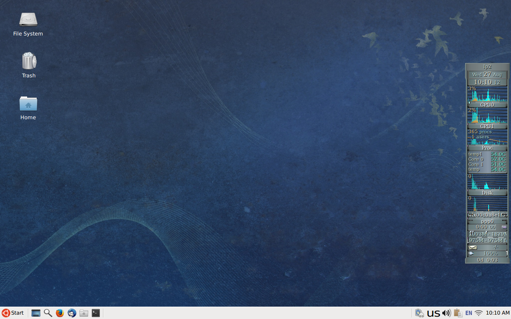

# dotfiles

Minimal and maintainable dotfiles for a functional Linux desktop — neatly
managed with [GNU Stow](https://www.gnu.org/software/stow/).



## What are dotfiles?

Dotfiles are user-specific configuration files on Unix-like systems,
typically hidden because their names begin with a dot (e.g. `.bashrc`,
`.profile`).
[Read more on their origin →](./history_of_dotfiles.md)

## **System Documentation**
- [System Info](./system_info.md)
- [Environment Setup](./environment.md)

## Programs

The complete list of programs I use is available in [environment.md](environment.md).

## Xfce Keyboard Shortcuts

### Desktop

| Action                         | Shortcut            |
|--------------------------------|---------------------|
| Display the Start menu         | Ctrl + Esc          |
| Display the Start menu         | Super               |
| Minimize or restore all windows| Super + D           |
| Open the File Manager          | Super + E           |
| Lock the screen                | Super + L           |
| Open the Application Finder    | Super + R           |
| Open the Screenshot program    | Shift + Super + S   |
| Open the Terminal Emulator     | Super + T           |
| Open the Web Browser           | Super + W           |
| Open the Task Manager          | Ctrl + Shift + Esc  |

## Installation

Before installing, read cowboy’s [gently-worded warning](https://github.com/cowboy/dotfiles#heed-this-critically-important-warning-before-you-install) and Anish Athalye’s [Dotfiles are NOT meant to be forked](http://www.anishathalye.com/2014/08/03/managing-your-dotfiles/).

1. **Install GNU Stow**

```sh
sudo apt install stow
```

2. **Clone this repo**

```sh
git clone https://github.com/tfarina/dotfiles.git ~/dotfiles
cd ~/dotfiles
```

3. **Stow desired config folders**

Instead of running `stow` manually, use the provided `setup.sh` helper script:

```sh
# Stow all default modules (bash, emacs, git, x11, xscreensaver, …)
./setup.sh

# Stow only selected modules
./setup.sh bash emacs
```

To **unstow** a module later, run the following inside the dotfiles directory:

```sh
cd ~/dotfiles
stow -D emacs
```
