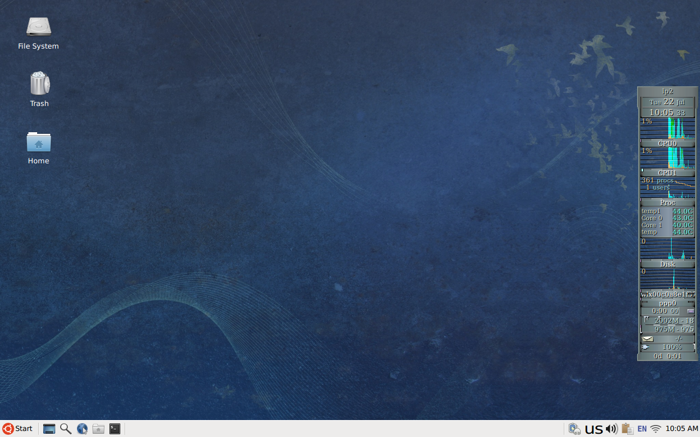

# dotfiles

They're managed using [GNU stow](https://www.gnu.org/software/stow/).



## Intro

> The legend goes that dot-files arose from a bug in the earliest days of
> UNIX: in an effort to avoid listing the . and .. entries of a directory,
> the ls command skipped files that began with the '.' character. As a result,
> any file with a name beginning with '.' was not reported by ls, i.e. it was
> a "hidden" file.
> A user's home directory was a convenient place to put user-specific
> configuration files, but such files were also an eyesore; one popular
> solution to this problem was to make those configuration files hidden so
> that they wouldn't annoy the user.
> Thus, the tradition of dot-files was born.
> From [Quora](https://www.quora.com/What-are-dotfiles/answer/Costya-Perepelitsa)

## What is a Rice?

> "Rice" is a word that is commonly used to refer to making visual improvements
> and customizations on one's desktop. It was inherited from the practice of
> customizing cheap Asian import cars to make them appear to be faster than
> they actually were - which was also known as "ricing".
From [/r/unixporn](https://www.reddit.com/r/unixporn/wiki/themeing/dictionary#wiki_rice)

## Programs

| Role  | Program |
| ------------- | ------------- |
| Boot Loader | [GRUB 2](https://www.gnu.org/software/grub/index.html) |
| Display Manager | [LightDM](https://github.com/canonical/lightdm) |
| Greeter | [LightDM GTK+ Greeter](https://github.com/Xubuntu/lightdm-gtk-greeter) |
| Session Manager | [xfce4-session](https://docs.xfce.org/xfce/xfce4-session/start) |
| Window Manager | [xfwm4](https://docs.xfce.org/xfce/xfwm4/start) |
| Panel | [xfce4-panel](https://docs.xfce.org/xfce/xfce4-panel/start) |
| Terminal Emulator | [URxvt](http://software.schmorp.de/pkg/rxvt-unicode.html) |
| Shell | [Bash](https://www.gnu.org/software/bash/) |
| Editor | [Emacs](https://www.gnu.org/software/emacs/) |
| Text Editor | [Gedit](https://gitlab.gnome.org/World/gedit/gedit/-/tree/master) |
| Application Finder | [xfce4-appfinder](https://docs.xfce.org/xfce/xfce4-appfinder/start) |
| Web Browser | [Firefox](https://www.mozilla.org/en-US/firefox/new) |
| Mail Reader | [Claws Mail](https://www.claws-mail.org), [Thunderbird](https://www.thunderbird.net/en-US/) |
| File Manager | [Thunar](https://gitlab.xfce.org/xfce/thunar) |
| Image Viewer | [Sxiv](https://github.com/muennich/sxiv), [Ristretto](https://docs.xfce.org/apps/ristretto/start) |
| Screen Capture | [Scrot](https://github.com/dreamer/scrot), [GNOME Screenshot](https://gitlab.gnome.org/GNOME/gnome-screenshot), [Xfce Screenshooter](https://docs.xfce.org/apps/xfce4-screenshooter/start) |
| Document Viewer | [Evince](https://wiki.gnome.org/Apps/Evince) |
| Clipboard Manager | [ClipIt](https://github.com/CristianHenzel/ClipIt) |
| Calculator | [galculator](http://galculator.mnim.org/) |

## Xfce Keyboard Shortcuts

| Press         | To            |
| ------------- | ------------- |
| Ctrl + Esc  | Display the Start menu |
| Super | Display the Start menu |
| Super + D | Minimize or restore all windows |
| Super + E | Open the File Manager |
| Super + L | Lock the screen |
| Super + R | Open the Application Finder |
| Shift + Super + S | Open the Screenshot program |
| Super + T | Open the Terminal Emulator |
| Super + W | Open the Web Browser |
| Ctrl + Shift + Esc  | Open the Task Manager |

## Installation

### Before installing, be sure to read useful cowboy [gently-worded note](https://github.com/cowboy/dotfiles#heed-this-critically-important-warning-before-you-install) and this excellent article by Anish Athalye: [Dotfiles are NOT meant to be forked](http://www.anishathalye.com/2014/08/03/managing-your-dotfiles/). That said, let's go with the installation:

1. **Install GNU Stow:** GNU Stow is available for all GNU+Linux distros and most other unix-like distributions via your package manager.

   Ubuntu:   `sudo apt install stow` \
   Arch:     `sudo pacman -S stow` \
   Mac:	     `brew install stow`

2. **Clone this repo:**

```sh
$ git clone https://github.com/tfarina/dotfiles.git ~/dotfiles && cd ~/dotfiles
```
3. **Symlink with GNU Stow the folder(s) you want to your home:** To install most of my dotfiles you execute `stow` with the folder name as the only argument.

```sh
$ stow -v -t ~/ -S bash
$ stow -v -t ~/ -S topic-name
```
## How to disable overlay scrollbars

```sh
$ gsettings set com.canonical.desktop.interface scrollbar-mode normal
```

## How to show the GRUB menu?

Press and hold Shift as soon as BIOS loads. If system had UEFI, you
would have to press Esc.

## How to disable gtk3-csd (client side decorations)?

To disable the UGLY gtk3 csd (client side decorations), first
download gtk3-nocsd_3-1_all.deb and libgtk3-nocsd0_3-1+b1_i386.deb
from https://packages.debian.org/trixie/all/gtk3-nocsd/download,
then install them with dpkg -i and reboot.

## How to get monospace font name used by Emacs?

```sh
$ gsettings get org.gnome.desktop.interface monospace-font-name
```

## How to get the name of default font on Xfce?

```sh
$ xfconf-query -c xsettings -p /Gtk/FontName
```

## How to fix macOS keyboard typing issue?

Open System Preferences, and select Keyboard. Then set "Key Repeat" to the
highest value "Fast". Also, set "Delay Until Repeat" to the highest value
"Short".
