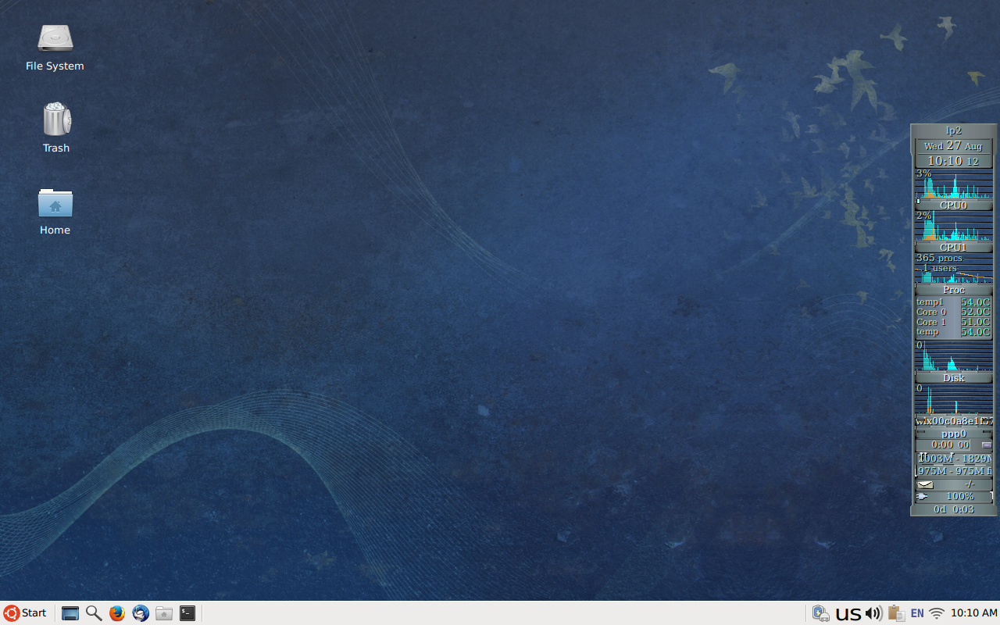

# dotfiles

A curated collection of configuration files for a minimal, efficient Linux desktop workflow. Automated setup with [GNU Stow](https://www.gnu.org/software/stow/) ensures clean, modular management.



## Quick Start

```bash
# Clone the repository
git clone https://github.com/tfarina/dotfiles.git ~/dotfiles
cd ~/dotfiles

# Install GNU Stow (if not already installed)
sudo apt install stow

# Deploy configurations
./setup.sh
```

## What's Inside

This repository contains configuration modules for:

- **Shell & Terminal** — Bash configuration with aliases and environment setup
- **Git** — Version control configuration and workflow helpers
- **Text Editors** — Emacs configuration with custom keybindings and extensions
- **Display Server** — X11 and Xscreensaver settings for XFCE desktop
- **Visual Design** — CSS styling, themes, and desktop backgrounds
- **Automation** — Shell scripts and build tools for system management

See [environment.md](docs/environment.md) for a complete program inventory.

## How It Works

Each top-level directory in this repo represents a self-contained configuration module (e.g., `bash/`, `emacs/`, `git/`). When you run `./setup.sh`, GNU Stow creates symlinks from each module into your home directory, keeping everything organized and trackable.

### Using Individual Modules

```bash
# Deploy specific modules only
./setup.sh bash emacs git

# Remove a module later
cd ~/dotfiles
stow -D emacs
```

## Design Philosophy

- **Minimal footprint** — Only essential configs, no bloat
- **Modular structure** — Deploy or remove features independently
- **Version controlled** — All configurations tracked and auditable
- **Portable setup** — Easy to replicate across systems

## Customization

Before deploying to a new system, review the configurations to ensure they match your preferences. Some modules may require adjustments for your specific environment.

**Key files to review:**
- `bash/.bashrc` — Shell environment and aliases
- `emacs/.emacs.d/` — Editor setup and extensions
- `x11/.xinitrc` — Display server initialization

## Documentation

- [System Information](./docs/system-info.md) — Hardware and OS details
- [Environment Setup](./docs/environment.md) — Complete tool and program list
- [Dotfiles History](./docs/history.md) — Background on configuration files

## Maintenance

- Keep modules in sync with your active system
- Archive unused configurations in `.archive/` for future reference
- Test changes on a secondary system before merging to main
