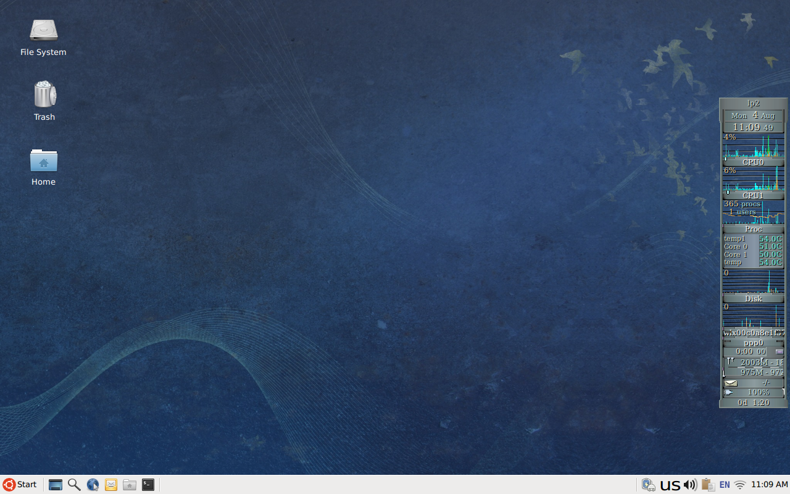

# dotfiles

Minimal and maintainable dotfiles for a functional Linux desktop — neatly
managed with [GNU Stow](https://www.gnu.org/software/stow/).



## What are dotfiles?

Dotfiles are user-specific configuration files on Unix-like systems,
typically hidden because their names begin with a dot (e.g. `.bashrc`,
`.profile`).
[Read more on their origin →](./history_of_dotfiles.md)

## **System Documentation**
- [System Info](./system_info.md)
- [Environment Setup](./environment.md)

## Programs

The complete list of programs I use is available in [environment.md](environment.md).

## Xfce Keyboard Shortcuts

| Press         | To            |
| ------------- | ------------- |
| Ctrl + Esc  | Display the Start menu |
| Super | Display the Start menu |
| Super + D | Minimize or restore all windows |
| Super + E | Open the File Manager |
| Super + L | Lock the screen |
| Super + R | Open the Application Finder |
| Shift + Super + S | Open the Screenshot program |
| Super + T | Open the Terminal Emulator |
| Super + W | Open the Web Browser |
| Ctrl + Shift + Esc  | Open the Task Manager |

## Installation

Before installing, read cowboy’s [gently-worded warning](https://github.com/cowboy/dotfiles#heed-this-critically-important-warning-before-you-install) and Anish Athalye’s [Dotfiles are NOT meant to be forked](http://www.anishathalye.com/2014/08/03/managing-your-dotfiles/).

1. **Install GNU Stow**

```sh
sudo apt install stow
```

2. **Clone this repo**

```sh
git clone https://github.com/tfarina/dotfiles.git ~/dotfiles
cd ~/dotfiles
```

3. **Stow desired config folders**

Instead of running `stow` manually, use the provided `setup.sh` helper script:

```sh
# Stow all default modules (bash, emacs, git, x11, xscreensaver, …)
./setup.sh

# Stow only selected modules
./setup.sh bash emacs
```

To **unstow** a module later, run the following inside the dotfiles directory:

```sh
cd ~/dotfiles
stow -D emacs
```

## Tips & Troubleshooting

### How to disable overlay scrollbars

```sh
gsettings set com.canonical.desktop.interface scrollbar-mode normal
```

### How to show the GRUB menu?

- Press and hold **Shift** as soon as BIOS loads.
- On UEFI systems, press **Esc** instead.

### How to disable GTK3 CSD (Client-Side Decorations)?

1. Download the `.deb` packages from [Debian's gtk3-nocsd package](https://packages.debian.org/trixie/all/gtk3-nocsd/download)

2. Install with `dpkg -i` and reboot

### How to get monospace font name used by Emacs?

```sh
gsettings get org.gnome.desktop.interface monospace-font-name
```

### How to get the name of default font on Xfce?

```sh
xfconf-query -c xsettings -p /Gtk/FontName
```
